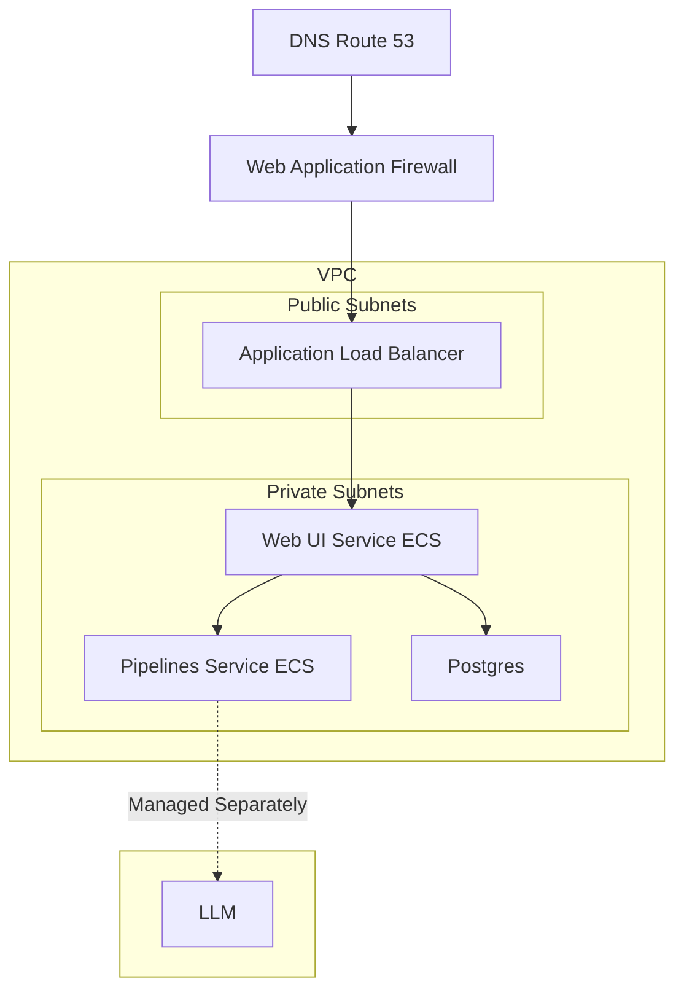

# arcee-open-webui
> Arcee's Customized Open WebUI Images and Deployment Template

Welcome! Arcee offers an integrated `open-webui` stack that you can deploy alongside your hosted models. For more information, visit [Arcee's website](https://www.arcee.ai/) or contact [sales@arcee.ai](mailto:sales@arcee.ai).


## Stack Overview
We offer select variations of our stack to handle different deployment scenarios. Please pick the appropriate one below and deploy it with CloudFormation:

| Template | Deploy | Detail |
|----|----|----|
| Default | <a href="https://console.aws.amazon.com/cloudformation/home?region=us-east-2#/stacks/quickcreate?templateURL=https://arcee-public-us-east-2-prod.s3.us-east-2.amazonaws.com/cfn/latest/openwebui.json"></a> | Publicly accessible with username password authentication |
| Public + OAuth | <a href="https://console.aws.amazon.com/cloudformation/home?region=us-east-2#/stacks/quickcreate?templateURL=https://arcee-public-us-east-2-prod.s3.us-east-2.amazonaws.com/cfn/latest/openwebui-oauth.json"></a> | Publicly accessible with OAuth |
| Private | <a href="https://console.aws.amazon.com/cloudformation/home?region=us-east-2#/stacks/quickcreate?templateURL=https://arcee-public-us-east-2-prod.s3.us-east-2.amazonaws.com/cfn/latest/openwebui-private.json"></a> | Privately deployed to your VPC with username password authentication |
| Private  + OAuth| <a href="https://console.aws.amazon.com/cloudformation/home?region=us-east-2#/stacks/quickcreate?templateURL=https://arcee-public-us-east-2-prod.s3.us-east-2.amazonaws.com/cfn/latest/openwebui-private-oauth.json"></a> | Privately deployed to your VPC with OAuth |


### Architecture Diagram


### Prerequisites
To launch this stack, you need:
1. A VPC with public and private subnets in at least two Availability Zones (AZs).
2. A Route53 Hosted Zone that matches the `DomainName` parameter and is correctly resolving.
3. An OpenAI-compatible inference endpoint, either in SageMaker or another service.

You will need to provide these parameters when deploying the stack.

## Docker Images
1. `ghcr.io/arcee-ai/arcee-open-webui`
   - This is the `open-webui` image with Arcee's branding and configurations.
2. `ghcr.io/arcee-ai/arcee-open-webui-pipelines`
   - This is the `open-webui/pipelines` image with Arcee's pre-loaded and configured pipelines.

## No-Egress Configurations
If you need all traffic to remain within your VPC, follow these additional steps:

### VPC Endpoints
To ensure that backend services can communicate with AWS services without egress, create interface VPC endpoints for the following services:
- `com.amazonaws.$region.logs`
- `com.amazonaws.$region.monitoring`
- `com.amazonaws.$region.secretsmanager`
- `com.amazonaws.$region.rds`
- `com.amazonaws.$region.ecr.dkr`
- `com.amazonaws.$region.elasticfilesystem`

If you are using a SageMaker Model Inference Endpoint you will also need a VPC endpoint for `com.amazonaws.$region.sagemaker.runtime`

These VPC endpoints should be configured as follows:
- **Security Group**: Allow inbound traffic from the VPC on port 443.
- **Subnets**: Use the private subnets of the VPC.
- **Private DNS**: Enable.

### ECR Images
The Docker images used by this stack are hosted in the GitHub Container Registry. Without network egress, AWS ECS will not be able to pull these images. You will need to provide AWS ECR image tags when deploying the CloudFormation stack and create the VPC endpoint for ECR.

#### Arcee Public ECR Images
You can use Arcee's public ECR images:
- OpenWebUI: `public.ecr.aws/v5o2z3j7/arcee-open-webui:main`
- Pipelines: `public.ecr.aws/v5o2z3j7/arcee-open-webui-pipelines:main`

To use Arcee's ECR images in this way, you will need a pull-through cache rule in your private ECR settings:
```bash
aws ecr create-pull-through-cache-rule --ecr-repository-prefix <your-ecr-repository-prefix> --upstream-registry-url https://public.ecr.aws/
```

And then initialize the images by triggering a pull through the cache:
```bash
aws ecr get-login-password --region <your-region> | docker login --username AWS --password-stdin <your-account-id>.dkr.ecr.<your-region>.amazonaws.com
docker pull <your-account-id>.dkr.ecr.<your-region>.amazonaws.com/<your-ecr-repository-prefix>/v5o2z3j7/arcee-open-webui:main --platform linux/amd64
docker pull <your-account-id>.dkr.ecr.<your-region>.amazonaws.com/<your-ecr-repository-prefix>/v5o2z3j7/arcee-open-webui:main --platform linux/amd64
```

When deploying the CloudFormation stack, provide the following parameters:
  - `OpenWebUiDockerImage=<your-account-id>.dkr.ecr.<your-region>.amazonaws.com/<your-ecr-repository-prefix>/v5o2z3j7/arcee-open-webui:main`
  - `PipelinesDockerImage=<your-account-id>.dkr.ecr.<your-region>.amazonaws.com/<your-ecr-repository-prefix>/v5o2z3j7/arcee-open-webui-pipelines:main`

> [!NOTE]
> In order to receive code updates from Arcee or OpenWebUI, you will need to trigger a pull through the cache by repeating the same `aws ecr get-login-password` and `docker pull` commands from above. It can take a few minutes for the images to update in your private ECR after running the pull command.

#### Host your own ECR images
If you cannot use Arcee's ECR images, you can host your own by following these steps:
1. Create an ECR repository in your AWS account.
2. Pull the images from GitHub:
   ```bash
   docker pull ghcr.io/arcee-ai/arcee-open-webui:main --platform linux/amd64
   docker pull ghcr.io/arcee-ai/arcee-open-webui-pipelines:main --platform linux/amd64
   ```
3. Tag the images for your ECR repository:
   ```bash
   docker tag ghcr.io/arcee-ai/arcee-open-webui:main <your-account-id>.dkr.ecr.<your-region>.amazonaws.com/<your-repo-name>:openwebui
   docker tag ghcr.io/arcee-ai/arcee-open-webui-pipelines:main <your-account-id>.dkr.ecr.<your-region>.amazonaws.com/<your-repo-name>:pipelines
   ```
4. Push the images to your ECR repository:
   ```bash
   docker push <your-account-id>.dkr.ecr.<your-region>.amazonaws.com/<your-repo-name>:openwebui
   docker push <your-account-id>.dkr.ecr.<your-region>.amazonaws.com/<your-repo-name>:pipelines
   ```
5. When deploying the CloudFormation stack, provide the following parameters:
   - `OpenWebUiDockerImage=<your-account-id>.dkr.ecr.<your-region>.amazonaws.com/<your-repo-name>:openwebui`
   - `PipelinesDockerImage=<your-account-id>.dkr.ecr.<your-region>.amazonaws.com/<your-repo-name>:pipelines`

> [!WARNING]
> By hosting your own Docker images, you will not directly receive code updates from Arcee or OpenWebUI, and will need to push updates to your repository.
