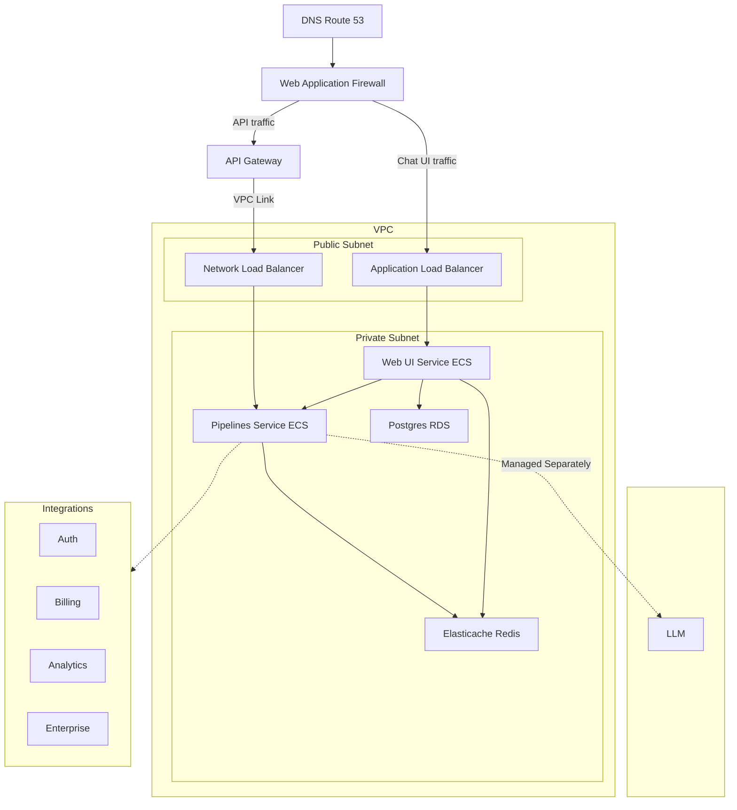

# arcee-open-webui *internal*

> [!CAUTION]
> Parts of this repo are public
>
> This document is our private entrypoint into this repo. If you work at Arcee, start here.

This repo contains a customized docker image for `open-webui` that includes Arcee's branding and standard configuration. Any settings may be overridden via environment variables just like the underlying image.

The main `README.md`, as well as the docker images (so, the code within them), are published openly on the GitHub Container Registry @ https://github.com/orgs/arcee-ai/packages.

We also publish the images to ECR Public to reduce steps in no-egress VPC deploys. (TODO: This is currently manual, but I will automate it in the github action and remove this note)

Currently, the CDK code (TypeScript) is _not_ published publicly.

"dist" stacks are minimally configured in `bin/open-webui.ts`, synthesized to CloudFormation templates (json), and uploaded to S3
 - These can be used by customers easily in CloudFormation
 - They can also form CloudFormation Quick Links like in the main readme
 - Multiple dist stacks can expose different configuration presets or options, ie our standard minimal "dist" and then another "dist-oauth" that's mostly the same but exposes oauth params for the user to provide at deploy-time

## CDK in this Project

The way we are using CDK to build and distribute the public CloudFormation templates is efficient but has important tradeoffs.

We chose to strip out the CDK dependencies on the final CloudFormation templates for a fully-native delivery (CDK is by AWS but requires an account bootstrap process, is CLI-only, etc etc), so in any paths that are distributed we can't use some of the nicer CDK features like dynamic lookups, account specific references, etc.

CloudFormation Parameters are crucial to the public template, but are weird to work with in CDK and get in the way when working on stacks we manage with CDK. Some important points:
- CFN parameters are deploy-time variables, meaning these are the options a user passes when creating or updating the stack
- For our own stacks, it is simpler, and more flexible, to manage these via config in CDK. So you will see most `CfnParameter` constructs have a default value that is read from `params`, which is the current CDK stack parameters in `bin/open-webui.ts`
- If a CFN parameter has a default parameter that is changed, it will not update in existing stacks and a new value will have to be passed explicitly. You can do this via CLI like `pnpm cdk deploy my-stack --parameters "InferenceApiBaseUrl=https://updated-model.cool/v1"`
- Inside CDK, you cannot read these values (because they are deploy time) and can only interact with them through CFN directives, conditions, etc. This is less than ideal, and often confusing. Care is required to make sure values are being read properly across CDK, CFN, config, etc etc


## Docker Images

To build locally, run:

```bash
docker build -t arcee-open-webui .
```

To run locally, run:

```bash
docker run --rm -it -p 8080:8080 arcee-open-webui
```

Or, you can run the stack locally with:

`docker compose up`

> You'll probably need to set some environment variables, either through .env files in the `dev`, or through the open-webui pipelines admin screen

## Image Delivery

Docker images are pushed to the GitHub container registry as public images, while this repo remains private.

The public can see the images (ie https://github.com/arcee-ai/arcee-open-webui/pkgs/container/arcee-open-webui), and the top-level README

See the [docker workflows in github actions](https://github.com/arcee-ai/arcee-open-webui/actions/workflows/docker-open-webui-publish.yml) for more details

## CloudFormation Delivery

The `dist` cdk stack is synthesized into CloudFormation templates and saved to a public bucket in S3 for use by customers deploying their own instances of this stack.

See the [cloudformation workflow in github actions](https://github.com/arcee-ai/arcee-open-webui/actions/workflows/cloudformation.yml) for more details.

## Hosted API Keys

See [this doc](https://docs.google.com/document/d/1PIOhfFJEUAyVgyXBAIlviKy_psQLppJgwRFeNzkBr_M/edit?usp=sharing) for more details -- more to come here!

## Arcee Deployments

We use this stack to power our own hosted models, ie https://supernova.arcee.ai. For our purposes, we can use the CDK fully instead of the resulting CloudFormation.

See the [cdk docs](https://github.com/arcee-ai/arcee-open-webui/blob/main/cdk/README.md) for more details

Our stacks are declared in [cdk/bin/open-webui.ts](https://github.com/arcee-ai/arcee-open-webui/blob/main/cdk/bin/open-webui.ts)

### The Full Stack

This stack supports far more than the public template allows. For our deployments of the stack via CDK, we include infrastructure for API use, scale, HA, auth, etc etc.

Compare to the diagram in the public README:



## `arcee_pipeline`

[pipelines/arcee_pipeline.py](https://github.com/arcee-ai/arcee-open-webui/blob/main/pipelines/arcee_pipeline.py) is a crucial aspect of this stack. It seamlessly connects to a SageMaker Inference endpoint *or* any other openai-compatible chat API
